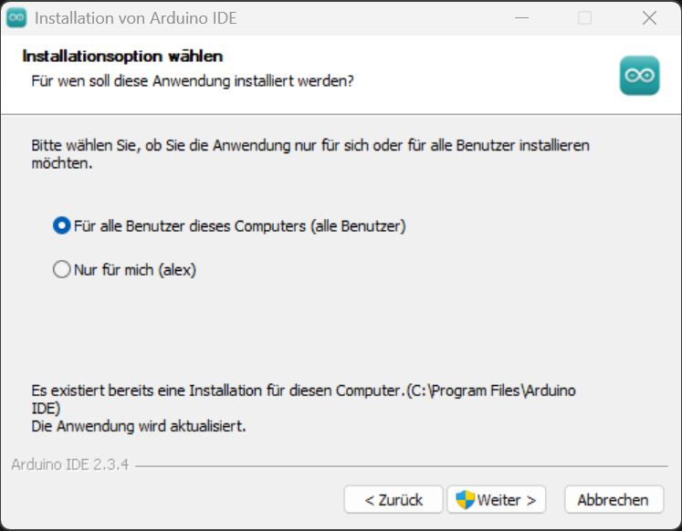
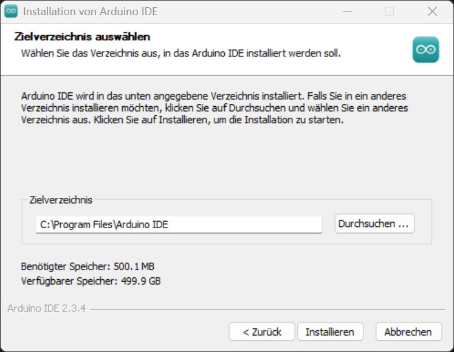
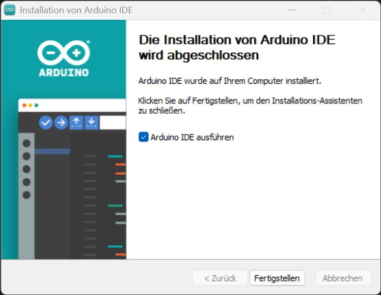
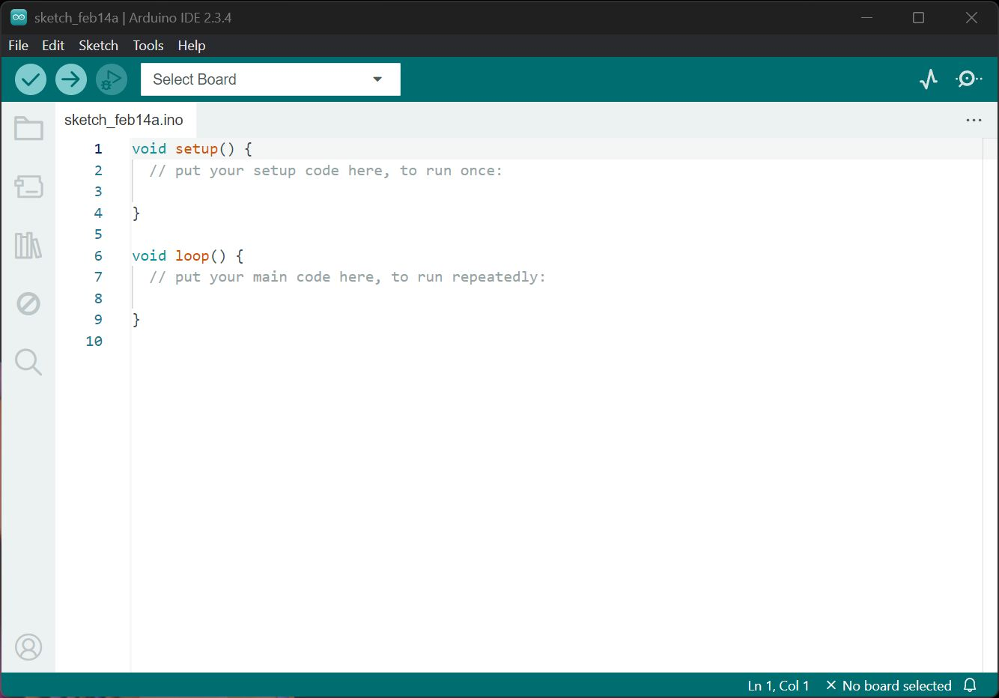

[<< Zurück](../README.md)

# Installation der Arduino IDE

Lade die Arduino IDE von folgender Seite herunter:

[Arduino IDE (Windows Win 10 and newer, 64 bits))](https://www.arduino.cc/en/software)

Die letzte getestete Version ist Arduino IDE 2.3.4

Die Nutzung der Aruino IDE ist kostenlos, aber eine Spende ist gewünscht.

Starte die Installation der Arduino IDE. 

Installiere die Arduino IDE für alle Benutzer auf deinem Computer.

Wähle das Standardverzeichnis für die Installation.

Die Installation ist erfolgreich abgeschlossen und die Arduino IDE wird direkt gestartet werden.

Nach dem ersten Start schaut die Oberfläche so aus: 

Als nächstes installiere den USB Treiber für den WEMOS D1 Mini Microcontroller.

[<< Zurück](../README.md)