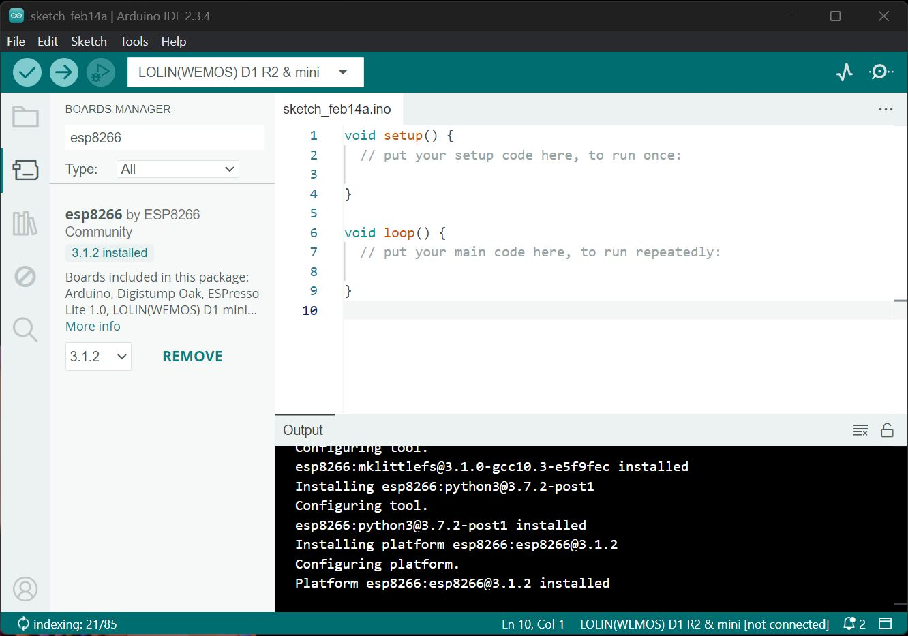
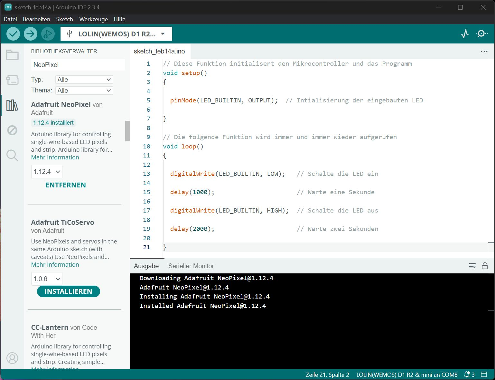
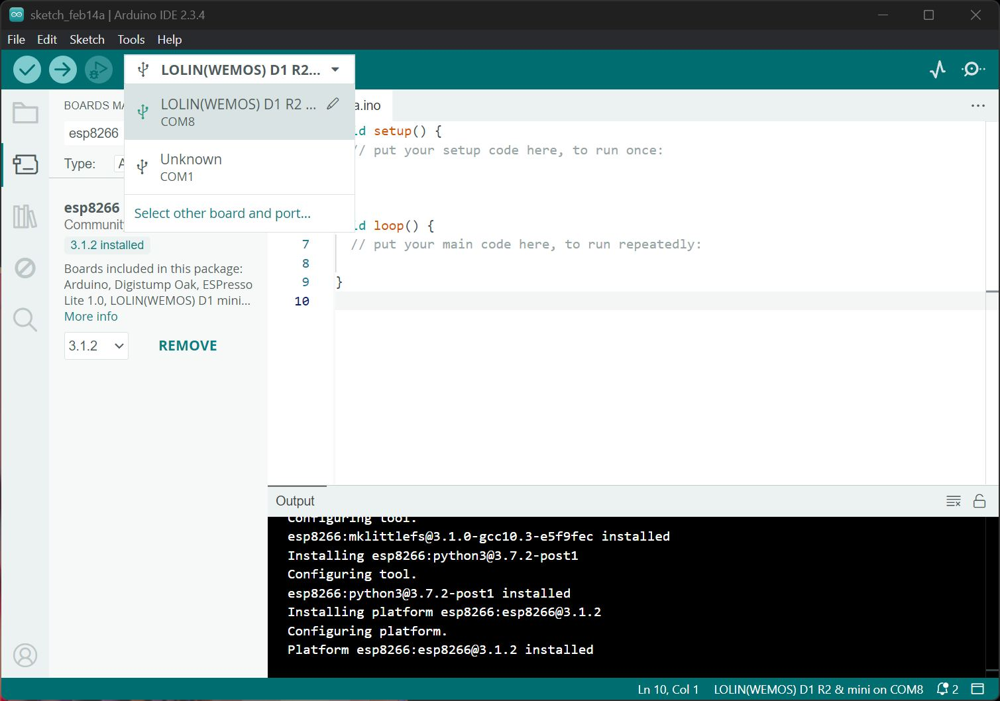
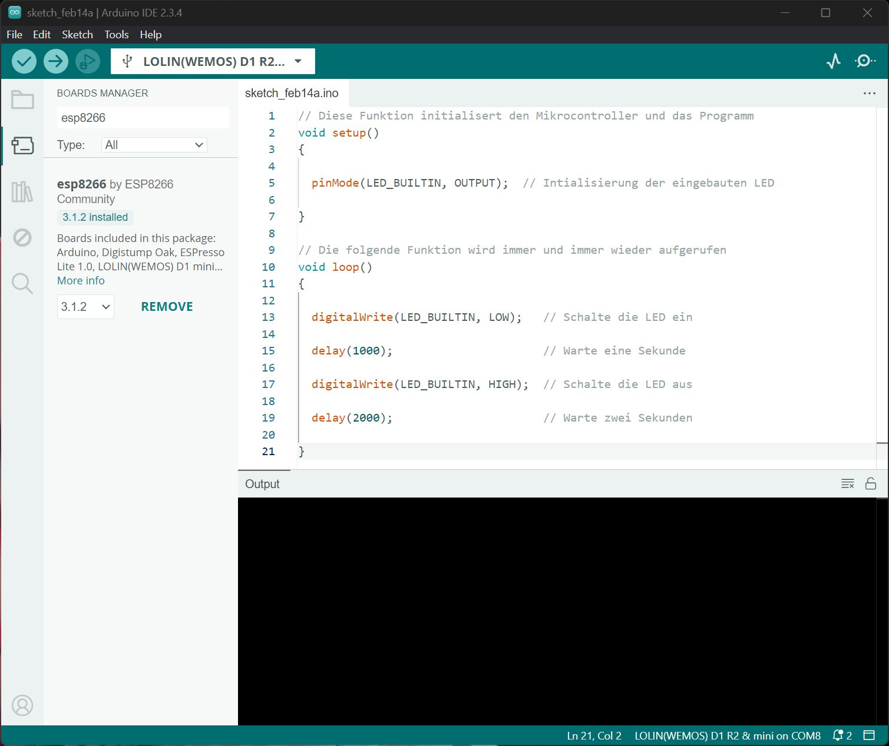
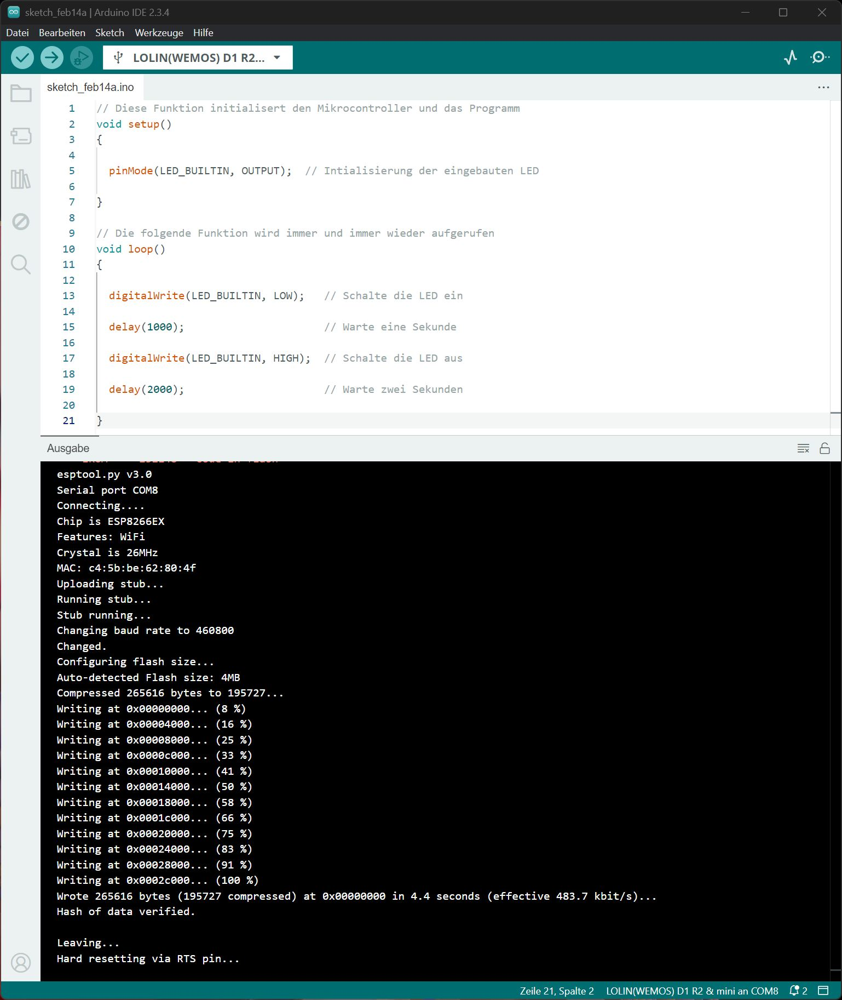

[<< Zurück](../README.md)

# Teil 1: Installation der Tools und erste Inbetriebnahme des Microcontrollers

## Schritt 1: Installation der Arduino IDE

Zur Programmierung des D1 Mini Microcontrollers ist die Arduino IDE notwendig. Lade die neueste Version unter folgendem Link herunter und installiere diese auf deinem PC.

[Arduino IDE](https://www.arduino.cc/en/software)

Unter folgendem Link findest du eine Schritt für Schritt Anleitung zur Installation falls benötigt, sonst weiter mit dem nächsten Schritt:

[Arduino IDE Installation](ArduinoIDE/README.md)

## Schritt 2: Installation des benötigten USB Treibers

Lade unter folgendem Link den für die Verwendung des D1 Mini benötigten USB Treiber herunter und installiere diesen auf deinem PC.

[CH340 USB Treiber](https://github.com/wemos/ch340_driver/raw/master/CH341SER_WIN_3.5.ZIP)

Unter folgendem Link findest du eine Schritt für Schritt Anleitung zur Installation des Treibers, falls du das nicht bereits selbst geschafft hast:

[USB Treiber Installation](USBTreiber/README.md)

## Schritt 3: Sprache der Arduino IDE in Deutsch ändern

Unter dem Menüpunkt File/Settings kannst du die Sprache auch auf Deutsch umstellen.
Anschließend musst du das Programm neu starten.

## Schritt 4: Installation der Boardbibilothek mit Hilfe des Board Managers

Für das Microcontroller Board D1 Mini wird das Board Paket "esp8266" benötigt. Öffne den Boardmanager durch Druck auf das zweite Symbol von oben auf der linken Seite oder im Menü "Tools/Board/Board Manager". Gebe im Suchfeld des Board Managers "esp8266" ein und es wird das Paket "esp8266" der ESP8266 Community angezeigt.


Starte die Installation durch Druck auf "INSTALL".

Wenn die Installation fertig ist erscheint das Board Paket "esp8266" auch im Menü "Tools/Board".

Als nächstes musst du das verwendete Board auswählen "LOLIN(WEMOS) D1 R2 & mini". Das machst du über den Menüpunkt "Tools/Board/esp8266/LOLIN(WEMOS) D1 R2 & mini".



## Schritt 5: Installation weiterer Bibliotheken

Damit du bestimmte Module verwenden kannst musst du noch ein paar Bibliotheken installieren. In den einzelnen Modulbeschreibungen wird jeweils beschrieben welche Bibliothek benötigt wird.

Eine Bibliothek kannst du ganz einfach unter dem Menüpunkt "Werkzeuge/Bibliotheken verwalten.." oder über das dritte Symbol von oben auf der Linken Leiste. Gebe oben Links einen Teil des Names der Bibliothek ein, z.B. NeoPixel und drücke dann auf Installieren der benötigten Bibliothek.



Installiere folgende Bibliotheken:

- Adafruit Neo Pixelvon Adafruit (RGB LED)


## Schritt 6: Anschluss des Microcontrollers an den PC und Auswahl des COM Ports

Stecke das Microncontroller Board auf das Basisboard zum Beispiel auf den mittleren Steckplatz. Du kannst alle drei beliebigen Steckplätze benutzen. Achte auf die richtige Polung. Die Pins mit der Beschriftung müssen übereinstimmen, z.B. Tx auf Tx und RST auf RST.

> [!CAUTION]
> Achte  darauf wenn du das Board mit den Händen anlangst, dass du nicht aufgeladen bist. Bei einer starken elektrostatischen Entladung könnte das Board kaputt gehen. Das gillt auch für alle anderen Module. Am besten berührst du etwas aus Metall zum Entladen, bevor du die Moduel in die Hand nimmst.

Bevor du das D1 Mini Board an den PC anschließt schaue unter dem Menüpunkt "Tools/Port" nach welche Ports bereits am PC vorhanden sind.
Schließe das D1 Mini Board jetzt mit dem USB Kabel an deinen PC an. Wenn du den USB Treiber intalliert hast sollte ime Menü "Tools/Port" ein neuer COM Port erscheinen. Wähle diesen im Menü aus.

In der Arduino IDE werden unter dem Menüpunkt Tools/Port: alle an deinem PC verfügbaren COM Ports angezeigt.

> [!TIP]
> Alternativ kann das Board und der angeschlossene Port auch über dem "Select other Board and Port..." in der Toolbar oben ausgewählt werden.



In unserem Beispiel ist es der Port COM8, es kann bei dir aber auch ein anderer Port sein.

## Schritt 7: Das Erste Microcontroller Programm

Das erste Microcontroller Programm das wir schreiben lässt die integrierte LED des D1 Mini Microcontroller Moduls blinken. Die LED wird für eine Sekunde eingeschaltet und für zwei Sekunden ausgeschaltet. Dies wird endlos wiederholt.

```
// Diese Funktion initialisert den Mikrocontroller und das Programm
void setup()
{

  pinMode(LED_BUILTIN, OUTPUT);  // Intialisierung der eingebauten LED

}

// Die folgende Funktion wird immer und immer wieder aufgerufen
void loop() 
{

  digitalWrite(LED_BUILTIN, LOW);   // Schalte die LED ein

  delay(1000);                      // Warte eine Sekunde

  digitalWrite(LED_BUILTIN, HIGH);  // Schalte die LED aus

  delay(2000);                      // Warte zwei Sekunden

}
```

Arduino Programme bestehen aus den zwei Funktionen setup() und loop(). setup() wird nur einmal beim ersten Start des Programmes aufgerufen, wenn der Microcontroller eingeschaltet wird. Die Funktion loop() wird kontinuierlich immer wieder aufgerufen.



## Schritt 6: Kompilierung und Übertragung des Programmes auf den Microcontroller

Als erstes muss das Programm geprüft und übersetzt werden. Drücke dafür im Menü auf "Sketch/Überprüfen/Kompilieren" oden auf das erste Symbol ober in der Toolbar. Wenn alles erfolgreich war erscheint "Kompilieren erfolgreich.".

Als nächstes musst du das Programm auf den Microcontroller hochladen. Benutze den Menüpunkt "Sketch/Upload" oder das zweite Symbol auf der oberen Toolbar. Wenn das erfolgreich war erscheint "Hochladen erfolgreich.".



Als nächstes machen wir uns näher mit dem WEMOS D1 Mini Board vertraut und lösen unsere erste Aufgabe.

[<< Zurück](../README.md)