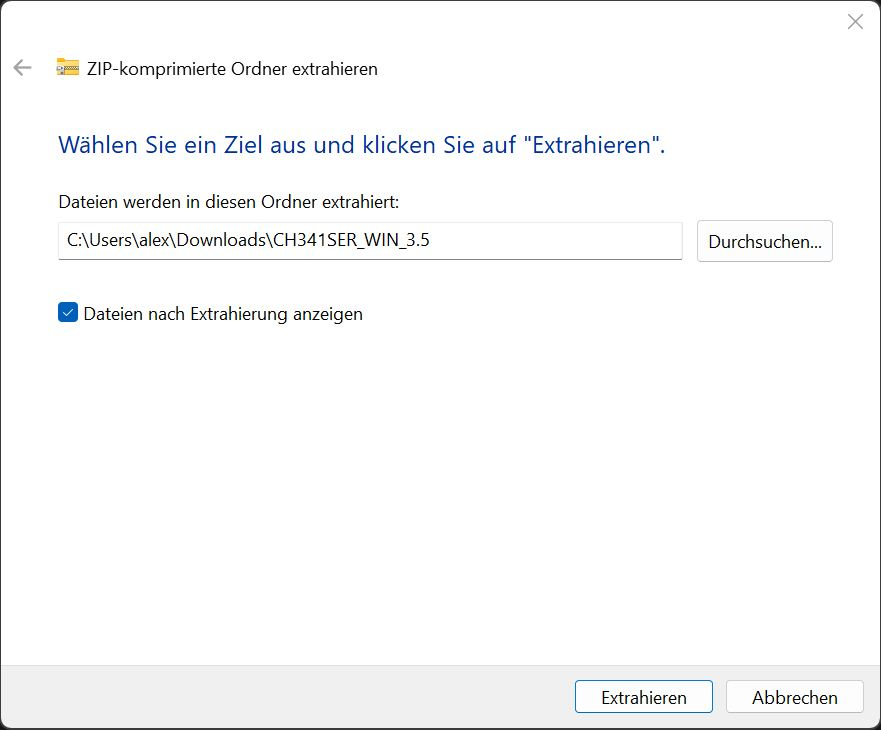

[<< Zurück](../README.md)

# Installation der USB Treiber

Lade den folgenden USB Treiber für den WEMOS D1 Mini Microcontroller herunter.

[CH340 USB Treiber](https://github.com/wemos/ch340_driver/raw/master/CH341SER_WIN_3.5.ZIP)

Die heruntergeladene Datei ist ein ZIP Paket.

Extrahiere die Datei in ein lokales Verzeichnis.

Starte die Installation durhc Aufruf von SETUP.EXE.

Starte die Installation mit INSTALL.

Die Installation ist erfolgreich wenn folgendes erscheint.

Als nächstes schließen wir das WEMOS D1 Mini am USB Port und schreiben wir unser erstes Programm.

[<< Zurück](../README.md)