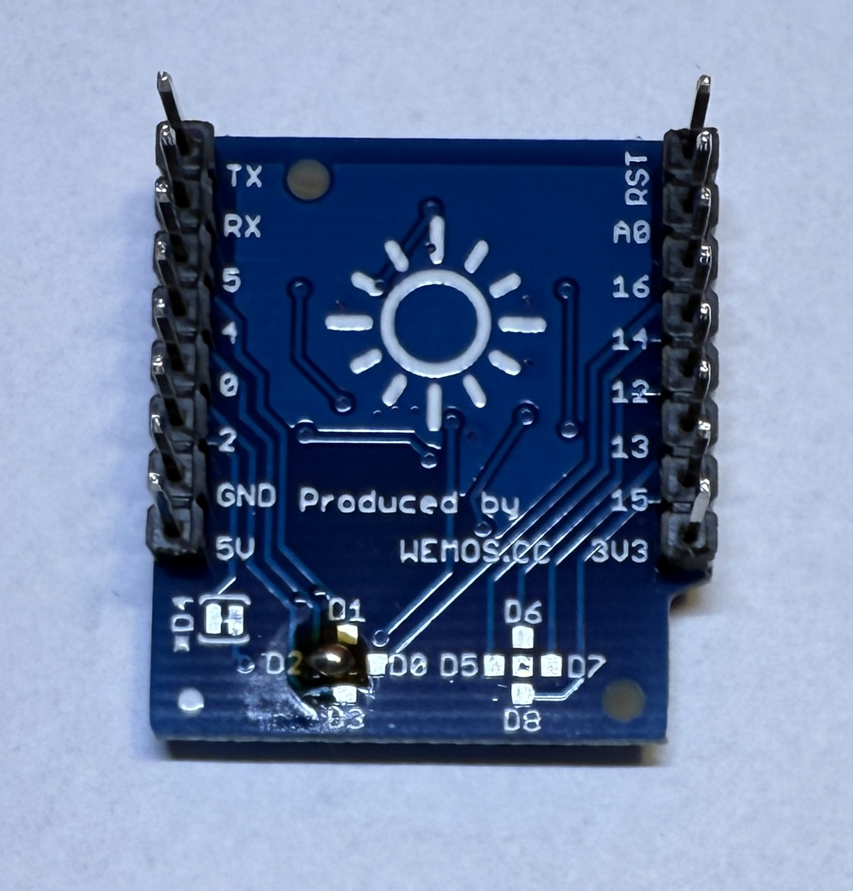
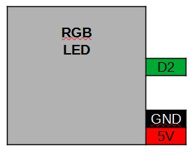
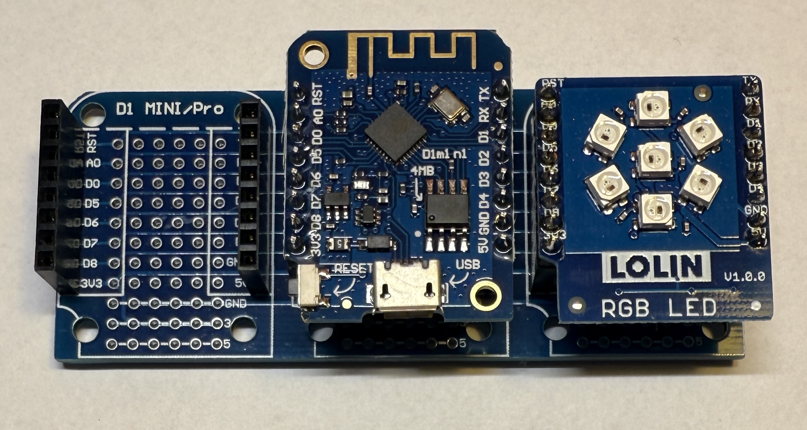

[<< Zurück](../README.md)

# 7 RGB LEDs

## Bilder




## Beschreibung

Das Modul hat sieben RGB LEDs die in verschiedenen Farben leuchten kann. Angebunden sind die LEDs über eine Eindraht Anbindung and Port D2 des Microcontrollers.

- WS2812B
- Pins: D2, GND, 5V

## Blockschaltbild



## Anwendung

Stecke das 7 LED RGB Modul auf einen der zwei freien Steckplätze. Achte auf die richtige Orientierung der Pins, RST auf RST und Tx auf Tx.




## Bibliothek

Folgende Bliothek wird benötiogt. Installiere diese über den Bibliotheks Verwalter:

- Adafruit Neo Pixelvon Adafruit (Getestet Version 1.12.4)

## Beispielprogramm 1: Blinken aller LEDs in grün

Als erstes lassen wir alle 7 LEDs in gruen blinken.

Dazu schreiben wir folgendes Programm

```
// Verwendete Bibliotheken
#include <Adafruit_NeoPixel.h>

#define PIN           D2
#define ANZAHL_PIXEL  7

Adafruit_NeoPixel pixels(ANZAHL_PIXEL, PIN, NEO_GRB + NEO_KHZ800);

// Diese Funktion initialisert den Mikrocontroller und das Programm
void setup()
{

  pixels.begin();  // Intialisierung der NeoPixel Bibliothek

}

// Die folgende Funktion wird immer und immer wieder aufgerufen
void loop() 
{
  pixels.clear();   // Alle Pixel zurücksetzen
  int num;
  for(num=0;num<7;num++)
    pixels.setPixelColor(num, pixels.Color(0, 255, 0));   // Setze die drei Farben Rot, Grün, Blau
  pixels.show();    // Sende die neue Farbe an die LED

  delay(1000);      // Warte eine Sekunde

  pixels.clear();   // Alle Pixel zurücksetzen
  for(num=0;num<7;num++)
    pixels.setPixelColor(num, pixels.Color(0, 0, 0));   // Setze die drei Farben Rot, Grün, Blau
  pixels.show();    // Sende die neue Farbe an die LED

  delay(2000);      // Warte zwei Sekunden
}
```
Kompiliere und lade das Programm hoch, wie bereits in der Installation gelernt.

Die LED sollte jetzt in grün blinken im Rythmus 1s an und 1s aus.

### Aufgabe 1: Lasse die LEDs nacheinander einzeln aufleuchten

Lasse die sechs äußeren LEDs einzeln nacheinander in rot leuchten.
LED in der Mitte ist die Nummer 0, die äußeren sind die LED 1-6.

Unter folgendem Link findest du die Lösung der ersten Aufgabe.

[Lösung Aufgabe 1](loesung_1.md)

[<< Zurück](../README.md) 