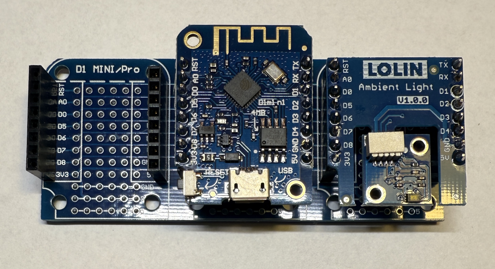

[<< Zurück](../README.md)

# Ambient Light v1.0.0

## Bilder


## Beschreibung

Das Modul hat eine eine Taste.

- Pins: D3, GND

## Blockschaltbild


## Anwendung

Stecke das Ambient Light Modul auf einen der zwei freien Steckplätze. Achte auf die richtige Orientierung der Pins, RST auf RST und Tx auf Tx.




## Bibliothek

- BH1750 von Christopher Laws

## Beispielprogramm 1: Ausgabe der Lichtstärke auf der seriellen Konsole

Wir geben die Lichtstärke auf der seriellen Konsole aus (9600 Baud).

Dazu schreiben wir folgendes Programm

```
#include <BH1750.h>
#include <Wire.h>

BH1750 lightMeter;

void setup() {
  Serial.begin(9600);

  Wire.begin();
  lightMeter.begin();

  Serial.println(F("BH1750 Test begin"));
}

void loop() {
  float lux = lightMeter.readLightLevel();
  Serial.print("Light: ");
  Serial.print(lux);
  Serial.println(" lx");
  delay(1000);
}

```
Kompiliere und lade das Programm hoch, wie bereits in der Installation gelernt.

[<< Zurück](../README.md) 