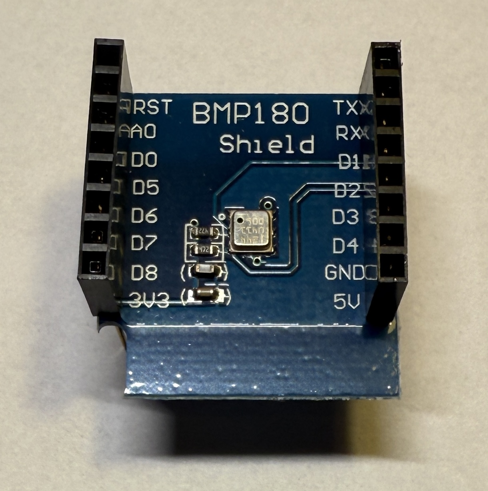

[<< Zurück](../README.md)

# BMP180

## Bilder



## Beschreibung

Das Modul hat einen Druck und Temperatur Sensor BMP180.

- Pins: D1 (SCL), D2 (SDA), GND, 3V3

## Blockschaltbild


## Anwendung

Stecke das BMP180 Modul auf einen der zwei freien Steckplätze. Achte auf die richtige Orientierung der Pins, RST auf RST und Tx auf Tx.

## Bibliothek

- Adafruit BMP085

## Beispielprogramm 1: Auslesen des Drucks und der Temperatur und Ausgabe auf serieller Konsole

Wir lesen den Druck und die Temperatur aus und geben diese auf der Konsole aus.

Dazu schreiben wir folgendes Programm

```
#include <Adafruit_BMP085.h>

Adafruit_BMP085 bmp;

// Diese Funktion initialisert den Mikrocontroller und das Programm  
void setup()
{

  Serial.begin(9600);
  if (!bmp.begin()) {
	Serial.println("Kann den BMP085 sensor nicht finden!");
	while (1) {}
  }

}

 // Die folgende Funktion wird immer und immer wieder aufgerufen 
void loop()
{

    Serial.print("Temperatur = ");
    Serial.print(bmp.readTemperature());
    Serial.println(" *C");
    
    Serial.print("Druck = ");
    Serial.print(bmp.readPressure());
    Serial.println(" Pa");
    
    Serial.print("Höhe = ");
    Serial.print(bmp.readAltitude());
    Serial.println(" Meter");

    Serial.print("Druck auf Meereshöhe (brechnet) = ");
    Serial.print(bmp.readSealevelPressure());
    Serial.println(" Pa");

    Serial.print("Echte Höhe altitude = ");
    Serial.print(bmp.readAltitude(102300));  // Aktueller Druck auf Meereshöhe
    Serial.println(" Meter");
    
    Serial.println();
    delay(500);

}
```
Kompiliere und lade das Programm hoch, wie bereits in der Installation gelernt.

## Aufgabe 1: LED abwechselnd ein- und ausschalten

Jedes mal wenn du drückst schaltest du die Taste ein oder aus.

[Lösung Aufgabe 1](loesung_1.md)

[<< Zurück](../README.md) 