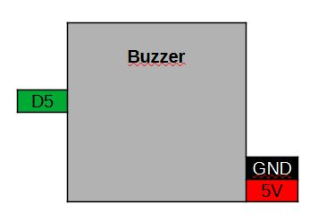

[<< Zurück](../README.md)

# Buzzer

## Bilder


## Beschreibung

Das Modul hat eine einen Muzzer.

- Pins: D5, GND, 5V

## Blockschaltbild



## Anwendung

Stecke das Buzzer Modul auf einen der zwei freien Steckplätze. Achte auf die richtige Orientierung der Pins, RST auf RST und Tx auf Tx.

## Bibliothek

- keine

## Beispielprogramm 1: Melodie spielen

Als erstes lassen wir eine kleine Melodie auf dem Buzzer spielen.

Dazu schreiben wir folgendes Programm

```
const int buzzer_pin=D5;

int freq[]={1047,1175,1319,1397,1568,1760,1976,2093};// C6 D6 E6 F6 G6 A6 B6 C7
String note[]={"C6", "D6", "E6", "F6", "G6", "A6", "B6", "C7"};

// Diese Funktion initialisert den Mikrocontroller und das Programm
void setup() {

  pinMode(buzzer_pin, OUTPUT);
  digitalWrite(buzzer_pin, LOW);

}

// Die folgende Funktion wird immer und immer wieder aufgerufen
void loop() {
  
  for(int i=0; i<8; i++)
  {
  
    analogWriteRange(freq[i]);
    
    analogWrite(buzzer_pin, 512);
    delay(1000);   // Warte 1s

    analogWrite(buzzer_pin, 0);
    pinMode(buzzer_pin, OUTPUT);    
    digitalWrite(buzzer_pin, LOW);
    delay(1000);  // Warte 1s
 
  }

  delay(5000);  // Warte 5s

}
```
Kompiliere und lade das Programm hoch, wie bereits in der Installation gelernt.

[<< Zurück](../README.md) 