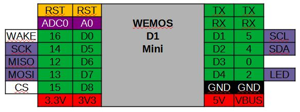

[<< Zurück](../README.md)

# Microcontroller D1 Mini

## Bilder


## Beschreibung

- Microcontroller ESP-8266EX
- 4MB Flash
- Eingebaute LED am Pin 2
- SPI Bus
- I2C Bus
- Arbeitsspannung 3.3V
- 1 Analoger Eingang
- 11 Digitale EIngänge/Ausgänge

## Blockschaltbild



## Anwendung

Stecke das D1Mini Board auf das Basisboard, falls nicht bereits geschehen. Schließe den USB Board an deine PC an.


## Board

Folgendes Board wird benötigt. Installiere dieses über die Board Verwaltung:

Board-Verwaltung:  esp8266 von ESP8266 Community (Getestet Version 3.1.2)

Boardauswahl: LOLIN(WEMOS) D1 R1 & Mini

### Programmbeispiel 1: Blinken der eingebauten LED

Als erstes lassen wir die eingebaute LED blinken wie bereits bei der Installation. Dazu schreiben wir folgendes Programm

```
// Diese Funktion initialisert den Mikrocontroller und das Programm
void setup()
{

  pinMode(LED_BUILTIN, OUTPUT);  // Intialisierung der eingebauten LED am Pin 2

}

// Die folgende Funktion wird immer und immer wieder aufgerufen
void loop() 
{

  digitalWrite(LED_BUILTIN, LOW);   // Schalte die LED ein

  delay(1000);                      // Warte eine Sekunde

  digitalWrite(LED_BUILTIN, HIGH);  // Schalte die LED aus

  delay(2000);                      // Warte zwei Sekunden

}
```
Kompiliere und lade das Programm hoch, wie bereits in der Installation gelernt.

Die eingebaute LED sollte jetzt blinken im Rythmus 1s an und 2s aus.

1s entspricht 1000ms.

### Programmbeispiel 2: Serielle Ausgabe am Terminal

Als zweites Beispiel wollen wir ein "Hello world" auf der seriellen Konsole ausgeben. Dazu schreiben wir folgendes Programm.

```
// Diese Funktion initialisert den Mikrocontroller und das Programm
void setup()
{

   Serial.begin(9600);  // Intialisierung des seriellen Ports

}

// Die folgende Funktion wird immer und immer wieder aufgerufen
void loop() 
{

  Serial.print("Hello world\n");  // Schreibe "Hello world" auf die serielle Konsole

  delay(2000);                  // Warte 2s
}
```

Kompiliere und lade das Programm hoch, wie bereits in der Installation gelernt.

Öffne den seriellen Monitor über den Menüpunkt "Werkzeuge/Serieller Monitor" oder das Icon ganz rechts oben in der Toolbar.
Stelle die Baudrate noch auf 9600 Baud ein.
Du kannst auch noch den Zeitstempel einschalten.


Jetzt solltest du alle 2s die Ausgabe "Hello world" sehen.

### Aufgabe 1: Blinken der eingebauten LED

Als erste Aufgabe verändern wir den Rythmus de Blinkens der LED.
Lasse die LED schneller blinken, 500ms an und 1s aus.
Verändere das Programm entsprechend.

Unter folgendem Link findest du die Lösung der ersten Aufgabe.

[Lösung 1](loesung_1.md)

### Aufgabe 2: Gib deinen Namen in der seriellen Konsole aus

Als zweite Aufgabe gebe in der Konsole deinen Namen jede Sekunde aus statt "Hello world" alle 2s im Beispiel.

Unter folgendem Link findest du die Lösung der zweiten Aufgabe.

[Lösung 2](loesung_2.md)

Du hast es geschafft, du hast das Microcontroller Board kenne gelernt, die ersten Programme geschrieben und auch die ersten Aufgaben gelöst. Als nächstes wollen wir weiter Module kennen lernen.

[<< Zurück](../README.md)
