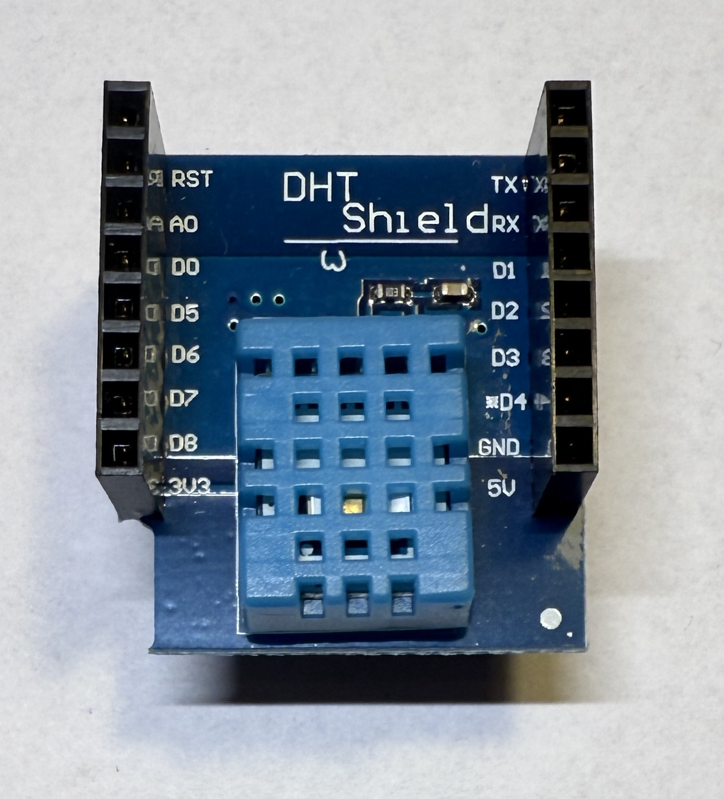

[<< Zurück](../README.md)

# DHT11

## Bilder



## Beschreibung

Das Modul hat einen Temperatur und Feuchtigkeitssensor DHT11.

- Pins: D4, GND, 3.3V

## Blockschaltbild


## Anwendung

Stecke das DHT11 Modul auf einen der zwei freien Steckplätze. Achte auf die richtige Orientierung der Pins, RST auf RST und Tx auf Tx.

## Bibliothek

- DHT sensor library von Adafruit

## Beispielprogramm 1: Ausgabe Temperatur und Feuchtigkeit auf serieller Konsole

Als erstes lassen wir die Temperatur und Feuchtigkeit auslesen und auf der seriellen Konsole ausgeben.

Dazu schreiben wir folgendes Programm

```
#include "DHT.h"

#define DHTPIN D4     

#define DHTTYPE DHT11   // DHT 11
//#define DHTTYPE DHT22     // DHT 22  (AM2302), AM2321
//#define DHTTYPE DHT21   // DHT 21 (AM2301)

DHT dht(DHTPIN, DHTTYPE);

// Diese Funktion initialisert den Mikrocontroller und das Programm
void setup() {

  Serial.begin(9600);
  Serial.println(F("DHTxx test!"));

  dht.begin();

}

// Die folgende Funktion wird immer und immer wieder aufgerufen
void loop() {

  delay(2000);

  float h = dht.readHumidity();
  float t = dht.readTemperature();

  if (isnan(h) || isnan(t)) {
    Serial.println(F("Fehler beim Auslesen des DHT sensor!"));
    return;
  }

  // Compute heat index in Celsius (isFahreheit = false)
  float hic = dht.computeHeatIndex(t, h, false);

  Serial.print(F("Humidity: "));
  Serial.print(h);
  Serial.print(F("%  Temperatur: "));
  Serial.print(t);
  Serial.print(F("°C "));
  Serial.print(F("Hitze Index: "));
  Serial.print(hic);
  Serial.print(F("°C\n"));

}
```
Kompiliere und lade das Programm hoch, wie bereits in der Installation gelernt.

## Aufgabe 1: LED abwechselnd ein- und ausschalten

Jedes mal wenn du drückst schaltest du die Taste ein oder aus.

[Lösung Aufgabe 1](loesung_1.md)

[<< Zurück](../README.md) 