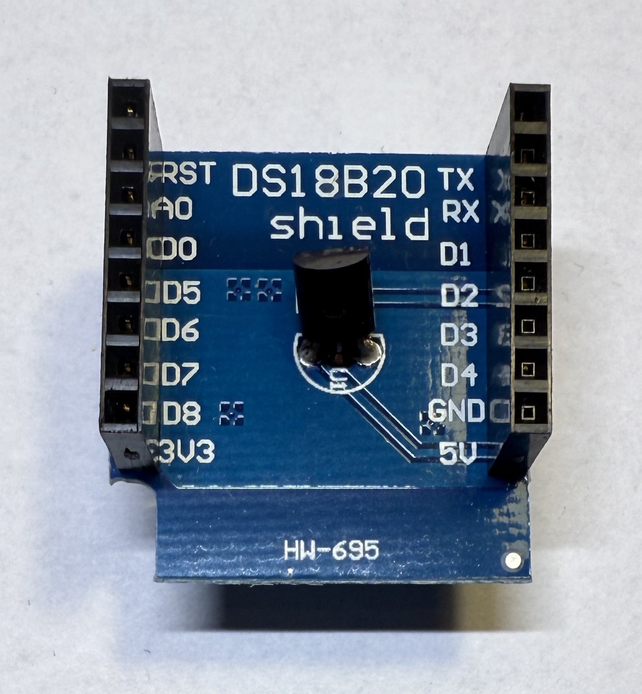

[<< Zurück](../README.md)

# Temperatur Sensor DS18B20

## Bilder



## Beschreibung

Das Modul hat eine eine Taste.

- Pins: D2, GND, 5V

## Blockschaltbild


## Anwendung

Stecke das Temperatur Modul auf einen der zwei freien Steckplätze. Achte auf die richtige Orientierung der Pins, RST auf RST und Tx auf Tx.

## Bibliothek

- OneWire von Jim Studt
- DallasTemperature von Miles Burton

## Beispielprogramm 1: Temperatur auslesen udn Ausgabe auf der seriellen Konsole

Wir lesen die Temperatur aus und geben sie auf der Konsole aus.

Dazu schreiben wir folgendes Programm

```
#include <OneWire.h>
#include <DallasTemperature.h>

#define ONE_WIRE_BUS D2

OneWire oneWire(ONE_WIRE_BUS);

DallasTemperature sensors(&oneWire);

// Diese Funktion initialisert den Mikrocontroller und das Programm
void setup(void)
{
  Serial.begin(9600);
  Serial.println("Dallas DS18B20 Temperatur Demo");

  sensors.begin();
}

// Die folgende Funktion wird immer und immer wieder aufgerufen
void loop(void)
{

  Serial.print("Lese die Temperatur aus...");
  sensors.requestTemperatures();
  Serial.println("Erledigt");
  delay(1500);

  float tempC = sensors.getTempCByIndex(0);

  if (tempC != DEVICE_DISCONNECTED_C)
  {
    Serial.print("Temperatur: ");
    Serial.println(tempC);
  }
  else
  {
    Serial.println("Fehler: Temperatur kann nicht ausgelesen werden");
  }

}
```
Kompiliere und lade das Programm hoch, wie bereits in der Installation gelernt.

[<< Zurück](../README.md) 