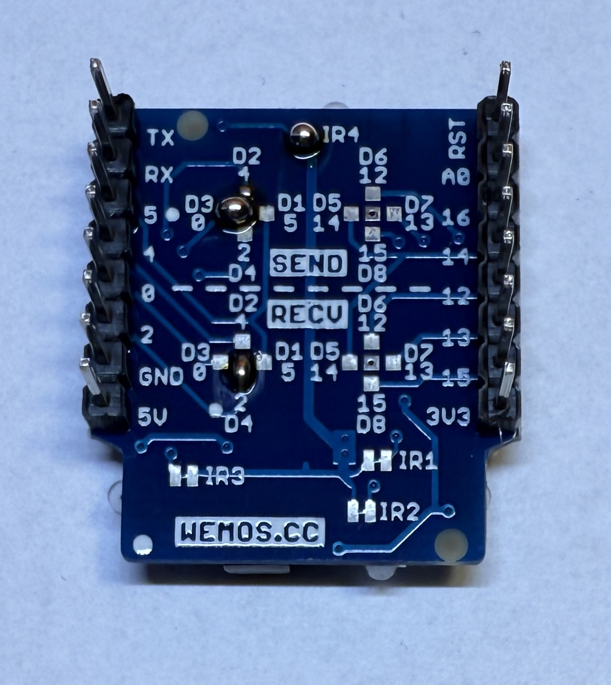
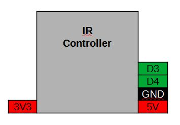
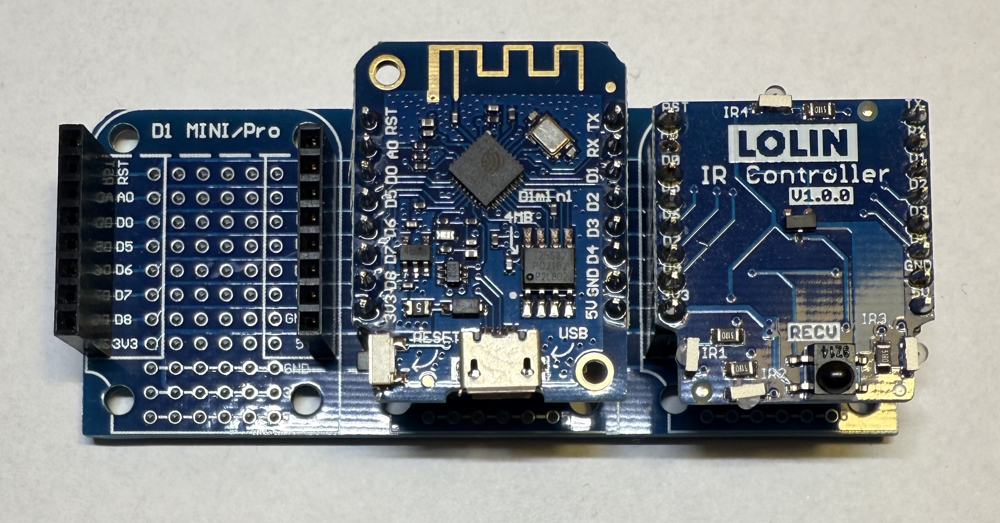

[<< Zurück](../README.md)

# IR Controller

## Bilder




## Beschreibung

Das Modul hat eine IR Sender und Empfänger.

- Pins: D3 (Send), D4 (Recv), GND

## Blockschaltbild



## Anwendung

Stecke das IR Controller Modul auf einen der zwei freien Steckplätze. Achte auf die richtige Orientierung der Pins, RST auf RST und Tx auf Tx.




## Bibliothek

- IRremoteESP8266 von David, Conran, Sebastian Warin,...

## Beispielprogramm 1: IR Signale Empfangen

Als erstes lassen empfange IR Signale am seriellen Port ausgeben.

Dazu schreiben wir folgendes Programm

```
#include <Arduino.h>
#include <IRremoteESP8266.h>
#include <IRrecv.h>
#include <IRutils.h>

const uint16_t kRecvPin = D4;

IRrecv irrecv(kRecvPin);

decode_results results;

void setup() {
  Serial.begin(115200);
  irrecv.enableIRIn();  // Start the receiver
  while (!Serial)  // Wait for the serial connection to be establised.
    delay(50);
  Serial.println();
  Serial.print("IRrecvDemo is now running and waiting for IR message on Pin ");
  Serial.println(kRecvPin);
}

void loop() {
  if (irrecv.decode(&results)) {
    // print() & println() can't handle printing long longs. (uint64_t)
    serialPrintUint64(results.value, HEX);
    Serial.println("");
    irrecv.resume();  // Receive the next value
  }
  delay(100);
}
```
Kompiliere und lade das Programm hoch, wie bereits in der Installation gelernt.

[<< Zurück](../README.md) 