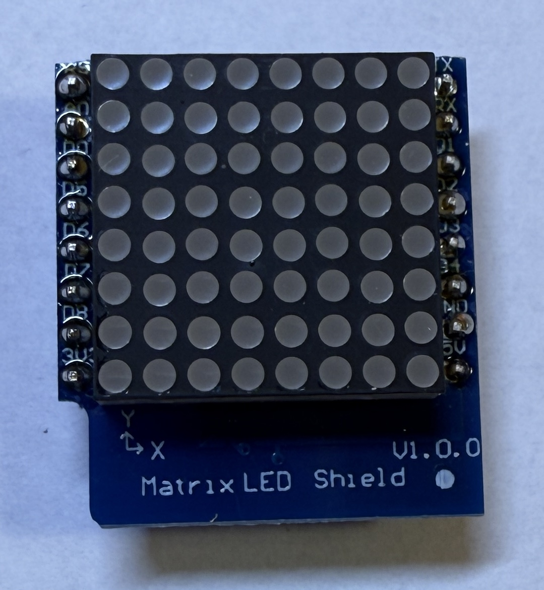
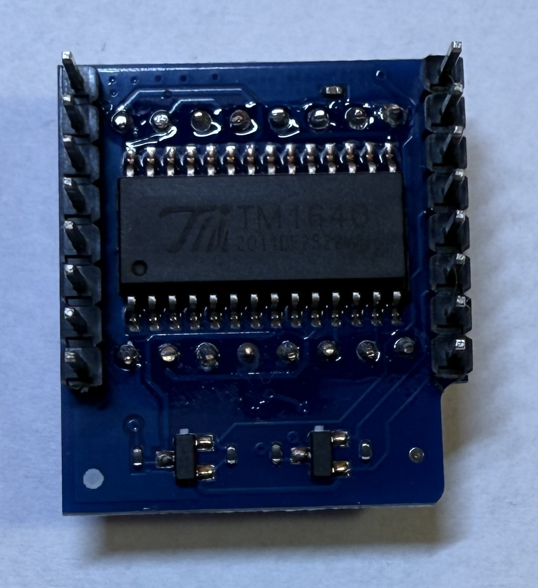

[<< Zurück](../README.md)

# LED Matrix

## Bilder




## Beschreibung

Das Modul hat 8x8 LEDs.

- TM1640 Display Treiber
- Pins: Clock D5, DIN D7

## Blockschaltbild


## Anwendung

Stecke das LED Matrix Modul auf einen der zwei freien Steckplätze. Achte auf die richtige Orientierung der Pins, RST auf RST und Tx auf Tx.


## Bibliothek

Folgende Bliothek wird benötiogt. Installiere diese über den Bibliotheks Verwalter:

- Wemos Matrix Adafruit GFX von Thomas O Fredericks

## Beispielprogramm 1: Blinkendes Rechteck 

Als erstes zeichnen wir ein Rechteck und lassen es blinken

Dazu schreiben wir folgendes Programm

```
// Verwendete Bibliotheken
#include <Adafruit_GFX.h>
#include <WEMOS_Matrix_GFX.h>

MLED matrix(7); // Helligkeit=7 (Maximum)

// Diese Funktion initialisert den Mikrocontroller und das Programm
void setup() 
{
   
}

// Die folgende Funktion wird immer und immer wieder aufgerufen
void loop()
{
 
  matrix.clear(); // Bild löschen
  matrix.drawRect(0,0, 8,8, LED_ON);
  matrix.writeDisplay(); // Sende das neue Bild
  delay(500);
  
  matrix.clear(); // Bild löschen
  matrix.drawRect(0,0,8,8, LED_OFF);
  matrix.writeDisplay();  // Sende das neue Bild
  delay(500);

}
```
Kompiliere und lade das Programm hoch, wie bereits in der Installation gelernt.

Jetzt solltest du ein blinkendes Rechteck sehen.

## Beispielprogramm 2: Kleinerwerdendes Rechteck

Als nächstes zeichnen wir ein Rechteck das immer kleiner wird.

Dazu schreiben wir folgendes Programm:

```
// Verwendete Bibliotheken
#include <Adafruit_GFX.h>
#include <WEMOS_Matrix_GFX.h>

MLED matrix(7); // Helligkeit=7 (Maximum)

// Diese Funktion initialisert den Mikrocontroller und das Programm
void setup() 
{
   
}

// Die folgende Funktion wird immer und immer wieder aufgerufen
void loop()
{
 
  matrix.clear(); // Bild löschen
  matrix.drawRect(0,0, 8,8, LED_ON);
  matrix.writeDisplay(); // Sende das neue Bild
  delay(500);
  
  matrix.clear(); // Bild löschen
  matrix.drawRect(1,1,7,7, LED_ON);
  matrix.writeDisplay();  // Sende das neue Bild
  delay(500);

  matrix.clear(); // Bild löschen
  matrix.drawRect(2,2,6,6, LED_ON);
  matrix.writeDisplay();  // Sende das neue Bild
  delay(500);

  matrix.clear(); // Bild löschen
  matrix.drawRect(3,3,5,5, LED_ON);
  matrix.writeDisplay();  // Sende das neue Bild
  delay(500);

  matrix.clear(); // Bild löschen
  matrix.drawRect(4,4,4,4, LED_ON);
  matrix.writeDisplay();  // Sende das neue Bild
  delay(500);

}
```
Kompiliere und lade das Programm hoch, wie bereits in der Installation gelernt.

## Beispielprogramm 3: Hüpfender Ball

Als nächstes zeichnen wir eine Ball der rauf und runter hüpft.

Dazu schreiben wir folgendes Programm:

```
// Verwendete Bibliotheken
#include <Adafruit_GFX.h>
#include <WEMOS_Matrix_GFX.h>

MLED matrix(7); // Helligkeit=7 (Maximum)

int y = 0;
int richtung = 1;

// Diese Funktion initialisert den Mikrocontroller und das Programm
void setup() 
{
   
}

// Die folgende Funktion wird immer und immer wieder aufgerufen
void loop()
{
 
  matrix.clear(); // Bild löschen
  matrix.drawRect(3,y, 2,2, LED_ON);
  matrix.writeDisplay(); // Sende das neue Bild
  delay(500);
  
  y = y + richtung;

  if(y>6)
  {
    y = 5;
    richtung=-1;
  }  

  if(y<0)
  {
    y = 1;
    richtung=1;
  }  

}
```
Kompiliere und lade das Programm hoch, wie bereits in der Installation gelernt.

### Aufgabe 1: Bewege den Ball von links nach rechts und wieder zurück

Als erste Aufgabe lassen wir einen Ball von links nach rechts und wieder zurück bewegen.

Unter folgendem Link findest du die Lösung der ersten Aufgabe.

[Lösung Aufgabe 1](loesung_1.md)

[<< Zurück](../README.md) 