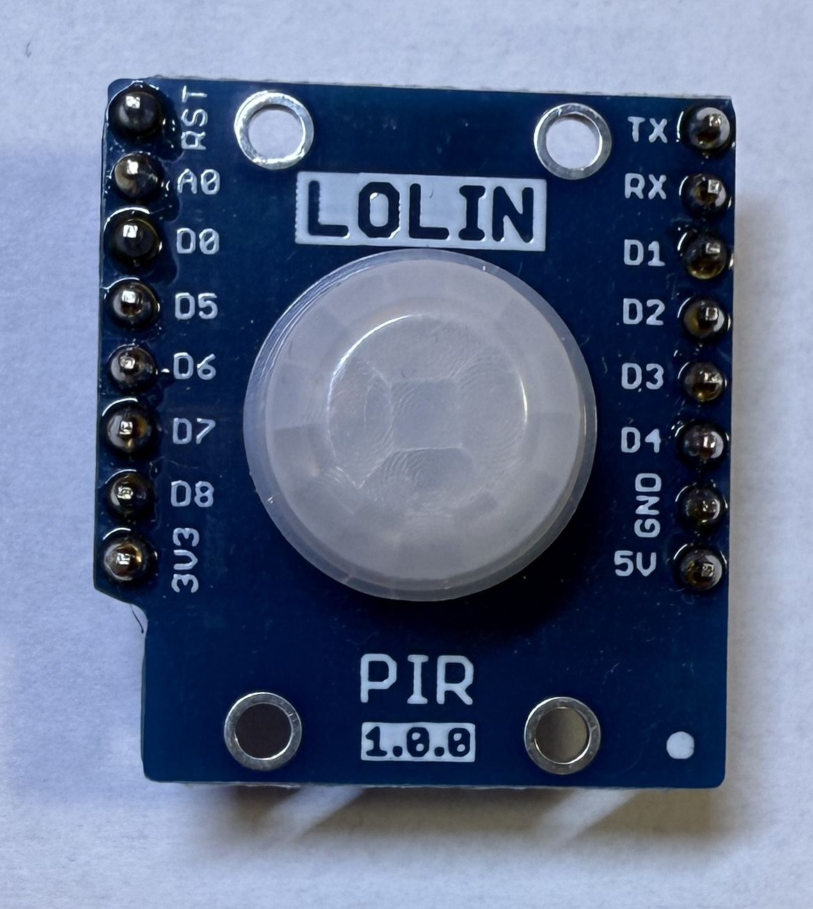
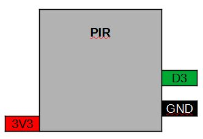

[<< Zurück](../README.md)

# PIR

## Bilder




## Beschreibung

Das Modul hat einen PIR Sensor eingebaut. Angebunden ist die LED über eine Eindraht Anbindung and Port D2 des Microcontrollers.

- Pins: D3, GND, 3.3V

## Blockschaltbild



## Anwendung

Stecke das PIR Modul auf einen der zwei freien Steckplätze. Achte auf die richtige Orientierung der Pins, RST auf RST und Tx auf Tx.


## Bibliothek

- Keine

## Beispielprogramm 1: Eingebaute LED leuchtet bei Bewegung

Wie lassen die eingebaute LED leuchten wenn eine Bewegung erkannt wird.

Dazu schreiben wir folgendes Programm

```
const int pin = D3;
int PIR_zustand = 0;

// Diese Funktion initialisert den Mikrocontroller und das Programm
void setup()
{

  pinMode(pin, INPUT);
  pinMode(BUILTIN_LED, OUTPUT);

  digitalWrite(BUILTIN_LED, HIGH); // Schalte LED aus

}

// Die folgende Funktion wird immer und immer wieder aufgerufen
void loop()
{

  PIR_zustand = digitalRead(pin);   // Lese des Status des PIR

  if (PIR_zustand == HIGH)
    digitalWrite(BUILTIN_LED, LOW);  // Schalte LED ein
  else
    digitalWrite(BUILTIN_LED, HIGH); // Schalte LED aus
  
}
```
Kompiliere und lade das Programm hoch, wie bereits in der Installation gelernt.

### Aufgabe 1: Schalte LED abwechselnd an und aus wenn eine Bewegung erkannt wurds

Unter folgendem Link findest du die Lösung der ersten Aufgabe.

[Lösung Aufgabe 1](loesung_1.md)

[<< Zurück](../README.md)