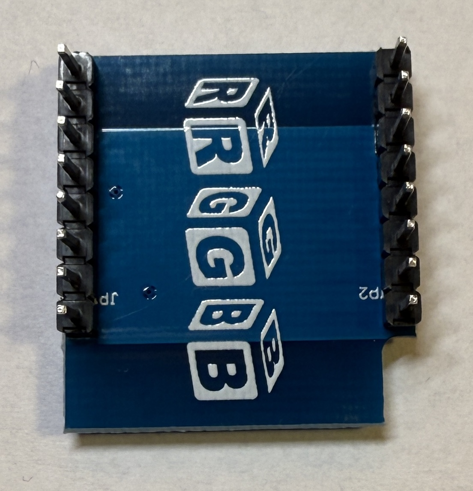
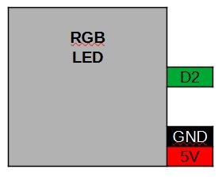
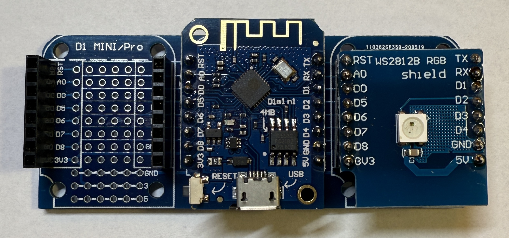

[<< Zurück](../README.md)

# RGB LED

## Bilder




## Beschreibung

Das Modul hat eine RGB LED die in verschiedenen Farben leuchten kann. Angebunden ist die LED über eine Eindraht Anbindung and Port D2 des Microcontrollers.

- WS2812B
- Pins: D2, GND, 5V

## Blockschaltbild



## Anwendung

Stecke das LED RGB Modul auf einen der zwei freien Steckplätze. Achte auf die richtige Orientierung der Pins, RST auf RST und Tx auf Tx.




## Bibliothek

Folgende Bliothek wird benötiogt. Installiere diese über den Bibliotheks Verwalter:

- Adafruit Neo Pixelvon Adafruit (Getestet Version 1.12.4)

## Beispielprogramm 1: Blinken der LED in grün

Als erstes lassen wir die LED in gruen blinken.

Dazu schreiben wir folgendes Programm

```
// Verwendete Bibliotheken
#include <Adafruit_NeoPixel.h>

#define PIN           D2
#define ANZAHL_PIXEL  1

Adafruit_NeoPixel pixels(ANZAHL_PIXEL, PIN, NEO_GRB + NEO_KHZ800);

// Diese Funktion initialisert den Mikrocontroller und das Programm
void setup()
{

  pixels.begin();  // Intialisierung der NeoPixel Bibliothek

}

// Die folgende Funktion wird immer und immer wieder aufgerufen
void loop() 
{
  pixels.clear();   // Alle Pixel zurücksetzen
  pixels.setPixelColor(0, pixels.Color(0, 255, 0));   // Setze die drei Farben Rot, Grün, Blau
  pixels.show();    // Sende die neue Farbe an die LED

  delay(1000);      // Warte eine Sekunde

  pixels.clear();   // Alle Pixel zurücksetzen
  pixels.setPixelColor(0, pixels.Color(0, 0, 0));   // Setze die drei Farben Rot, Grün, Blau
  pixels.show();    // Sende die neue Farbe an die LED

  delay(2000);      // Warte zwei Sekunden
}
```
Kompiliere und lade das Programm hoch, wie bereits in der Installation gelernt.

Die LED sollte jetzt in grün blinken im Rythmus 1s an und 1s aus.

## Beispielprogramm 2: Jetzt lassen wir die LED nacheinander in den drei Farben Rot, Grün und Blau blinken

Als nächstes lassen wir die LED abwechselnd in rot, gruen und blau blinken.

Dazu schreiben wir folgendes Programm:

```
// Verwendete Bibliotheken
#include <Adafruit_NeoPixel.h>

#define PIN           D2
#define ANZAHL_PIXEL  1

Adafruit_NeoPixel pixels(ANZAHL_PIXEL, PIN, NEO_GRB + NEO_KHZ800);

// Diese Funktion initialisert den Mikrocontroller und das Programm
void setup()
{

  pixels.begin();  // Intialisierung der NeoPixel Bibliothek

}

// Die folgende Funktion wird immer und immer wieder aufgerufen
void loop() 
{
  pixels.clear();   // Alle Pixel zurücksetzen
  pixels.setPixelColor(0, pixels.Color(255, 0, 0));   // Setze die drei Farben Rot, Grün, Blau
  pixels.show();    // Sende die neue Farbe an die LED

  delay(1000);      // Warte eine Sekunde

  pixels.clear();   // Alle Pixel zurücksetzen
  pixels.setPixelColor(0, pixels.Color(0,255, 0));   // Setze die drei Farben Rot, Grün, Blau
  pixels.show();    // Sende die neue Farbe an die LED

  delay(1000);      // Warte zwei Sekunden

  pixels.clear();   // Alle Pixel zurücksetzen
  pixels.setPixelColor(0, pixels.Color(0, 0,255));   // Setze die drei Farben Rot, Grün, Blau
  pixels.show();    // Sende die neue Farbe an die LED

  delay(1000);      // Warte zwei Sekunden
}
```
Kompiliere und lade das Programm hoch, wie bereits in der Installation gelernt.

Die LED sollte jetzt in grün blinken im Rythmus 1s an und 1s aus.

### Aufgabe 1: Blinken der eingebauten LED in verschiedenen Farben in unterschiedlichen Rythmus

Als erste Aufgabe lasse die LED in folgendem Farben und Rythmus blinken:

- Grün 2s
- Aus 1s
- Blau 2s
- Aus 1s
- Rot 2s
- Aus 1s

Unter folgendem Link findest du die Lösung der ersten Aufgabe.

[Lösung Aufgabe 1](loesung_1.md)

### Aufgabe 2: Blinken einer Ampel

Als zweite Aufgabe lasse wir die LED ähnlich einer Ampel blinken:

- Rot 10s
- Gelb 1s
- Grün 10s
- Gelb 2s

Unter folgendem Link findest du die Lösung der ersten Aufgabe.

[Lösung Aufgabe 2](loesung_2.md)

[<< Zurück](../README.md) 