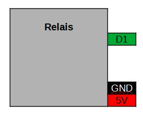
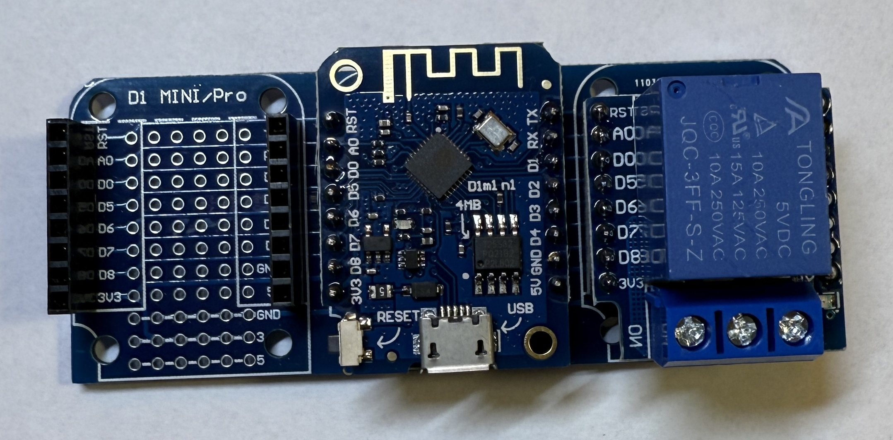

[<< Zurück](../README.md)

# Relais

## Bilder


## Beschreibung

Das Modul hat ein Relais.

- Pins: D1, GND, 5V

## Blockschaltbild



## Anwendung

Stecke das Relais Modul auf einen der zwei freien Steckplätze. Achte auf die richtige Orientierung der Pins, RST auf RST und Tx auf Tx.



## Bibliothek

- keine

## Beispielprogramm 1: Relais ein und ausschalten 

Als erstes lassen wir das Relais abwechselnd ein und ausschalten

Dazu schreiben wir folgendes Programm

```
const int relais_pin = D1;  // Initialisiere den Pin für das Relais

// Diese Funktion initialisert den Mikrocontroller und das Programm
void setup()
{
  pinMode(relais_pin, OUTPUT);
}

// Die folgende Funktion wird immer und immer wieder aufgerufen
void loop() 
{
  digitalWrite(relais_pin, HIGH); // Relais einschalten
  delay(2000);                    // Warte 2s
 
  digitalWrite(relais_pin, LOW);  // Relais ausschalten
  delay(2000);                    // Warte 2s
}
```
Kompiliere und lade das Programm hoch, wie bereits in der Installation gelernt.


### Aufgabe 1: Relais lange an und kurz aus ausschalten

Schalte das Relais in folgendem Rythmus an und aus

- Einschalten 3s
- Ausschalten 1/2s

Unter folgendem Link findest du die Lösung der ersten Aufgabe.

[Lösung Aufgabe 1](loesung_1.md)

[<< Zurück](../README.md) 