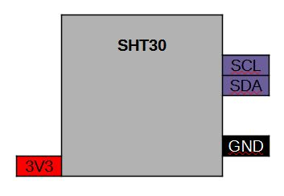

[<< Zurück](../README.md)

# Temperatur und Feuchtigkeits Sensor SHT30

## Bilder


## Beschreibung

Das Modul hat einen Temperatur und einen Feuchtigkeits Sensor.

- Pins: D3, GND

## Blockschaltbild



## Anwendung

Stecke das SHT30 Modul auf einen der zwei freien Steckplätze. Achte auf die richtige Orientierung der Pins, RST auf RST und Tx auf Tx.

## Bibliothek

- https://github.com/wemos/WEMOS_SHT3x_Arduino_Library

## Beispielprogramm 1: Auslesen der Temperatur und der Feuchtigkeit und Ausgabe auf der seriellen Konsole

Auslesen der Temperatur und der Feuchtigkeit und Ausgabe auf der seirellen Konsole (9600 Baud).

Dazu schreiben wir folgendes Programm

```
#include <WEMOS_SHT3X.h>

SHT3X sht30(0x45);

// Diese Funktion initialisert den Mikrocontroller und das Programm
void setup() 
{

  Serial.begin(9600);
  Wire.begin();

}

// Die folgende Funktion wird immer und immer wieder aufgerufen
void loop() 
{

  if(sht30.get()==0)
  {
    Serial.print("Temperatur in Celsius : ");
    Serial.println(sht30.cTemp);
    Serial.print("Relative Feuchtigkeit : ");
    Serial.println(sht30.humidity);
    Serial.println();
  }
  else
  {
    Serial.println("Fehler!");
  }
  delay(1000);

}

```
Kompiliere und lade das Programm hoch, wie bereits in der Installation gelernt.

[<< Zurück](../README.md) 