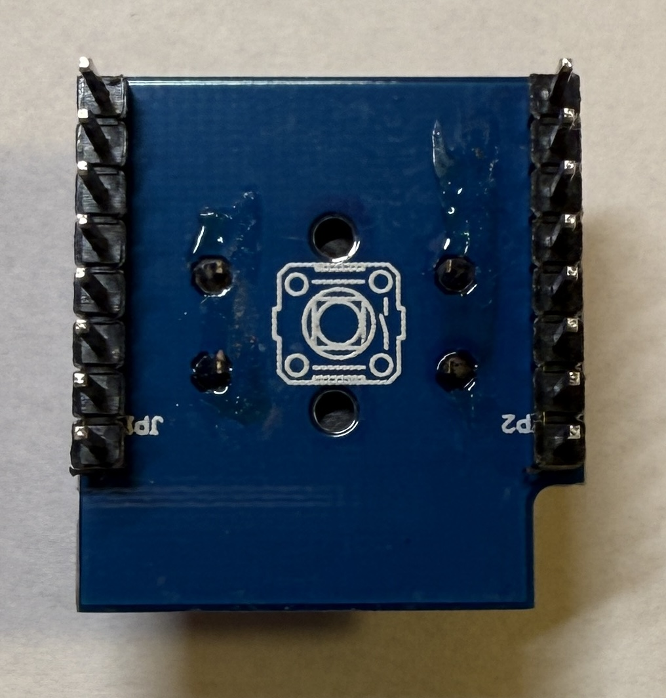
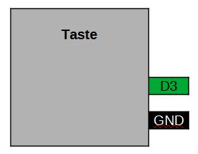
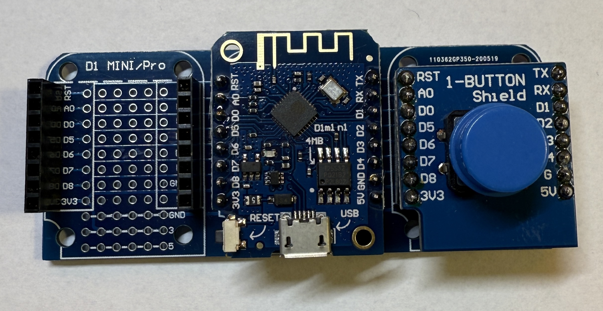

[<< Zurück](../README.md)

# Taste

## Bilder




## Beschreibung

Das Modul hat eine eine Taste.

- Pins: D3, GND

## Blockschaltbild



## Anwendung

Stecke das Tasten Modul auf einen der zwei freien Steckplätze. Achte auf die richtige Orientierung der Pins, RST auf RST und Tx auf Tx.




## Bibliothek

- keine

## Beispielprogramm 1: Ein- Auschalten der eingebauten LED mit der Taste

Als erstes lassen wir die eingebaute LED mit der Taste ein- und ausschalten.

Dazu schreiben wir folgendes Programm

```
const int tasten_pin = D3;
const int led_pin = BUILTIN_LED;

int tasten_zustand = 0;

// Diese Funktion initialisert den Mikrocontroller und das Programm
void setup() {

  pinMode(led_pin,OUTPUT);
  pinMode(tasten_pin,INPUT);

  digitalWrite(led_pin, tasten_zustand);

}

// Die folgende Funktion wird immer und immer wieder aufgerufen
void loop() {

  tasten_zustand = digitalRead(tasten_pin);
  
  if(tasten_zustand == HIGH)
  {
    digitalWrite(led_pin, HIGH);  // LED einschalten
  }
  else
  {
    digitalWrite(led_pin, LOW);  // LED ausschalten
  }
  
}
```
Kompiliere und lade das Programm hoch, wie bereits in der Installation gelernt.

## Aufgabe 1: LED abwechselnd ein- und ausschalten

Jedes mal wenn du drückst schaltest du die Taste ein oder aus.

[Lösung Aufgabe 1](loesung_1.md)

[<< Zurück](../README.md) 