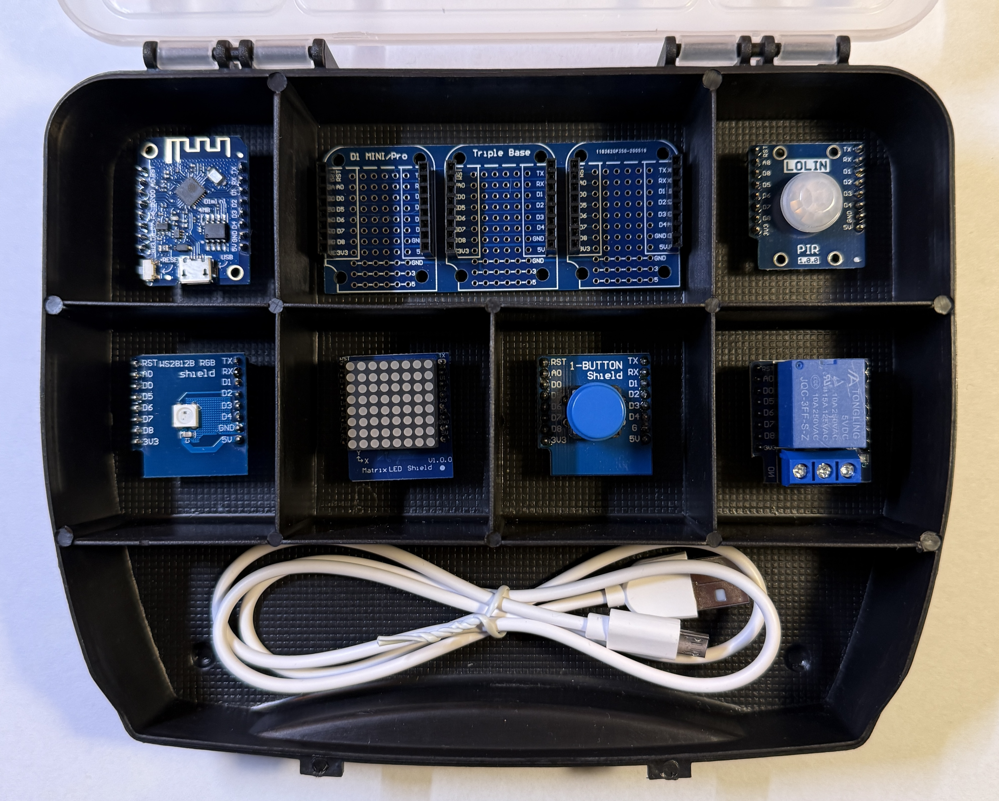

# Dokumentation zum WEMOS D1 Mini Kit
Das WEMOS D1 Mini Kit bietet einen einfachen und kostengünstigen Einstieg in die Mikrokontroller Programmierung und den Aufbau erster Sensornetzwerke. Die WEMOS D1 Mini Module und ihre diversen Varianten sind sehr beliebt in der Maker Szene. Das hier vorgestellte Kit soll den Einstieg vereinfachen, indem bereits fertig gelötete und getestete Module bereitgestellt werden. Somit ist kein Lötequipment und keine Lötkentnisse notwendig. Das einzige Voraussetzung um das Kit nutzen zu können ist ein PC oder Notebook mit Windows, Linux oder macOS. In dieser Dokumentation wird auf Windows eingegangen. Die Programmierung erfolgt in der Programmiersprache C, ist aber aufgrund der vielen Beispiele auch einfach zu erlernen.

Das Kit besteht aus einen Basisboard mit drei Steckplätzen, einem Mikrocontroller Board und verschiedenen Modulen mit diversen Sensoren und Aktoren. Je nach Variante des Kits werden unterschiedliche Varianten eines Microcontrollers und eine unterschiedliche Anzahl von Sensormodulen bereitgestellt.

Das Kit kann erworben werden, bitte Kontakt aufnehmen bzgl. Preis und Verfügbarkeit.

Dieses Github Projekt stellt die Dokumentation für das Kit inkl. diverser Programmbeispiele zur Verfügung.

Im ersten Teil wird beschrieben, wo die SW zum Programmieren gefunden wird, wie die SW installiert wird und wie die erste SW für den Mikrocontroller programmiert wird.

Im zweiten Teil werden die einzelnen Module detailliert beschrieben inkl. Codebeispielen und kleineren Aufgaben für den schnellen Einstieg, ideal für Anfänger.

Im dritten Teil werden dann komplexere SW Projekte in Kombination mit mehreren Modulen vorgestellt.

## Teil 1: Installation der Tools und erste Inbetriebnahme des Microcontrollers

[Installation der Tools und erste Inbetriebnahme](Installation/README.md)

## Teil 2: Beschreibung aller Module des Kits inkl. Programmbeispielen und Aufgaben für den schnellen Einstieg

[Dokumentation zu den verwendeten Microcontrollers und allen Modulen des Kits](Module/README.md)

## Teil 3: Komplexe SW Projekte unter Werwendung mehrerer Modulen

[Beschreibung zu komplexeren SW Projekten](SWProjekte/README.md)

