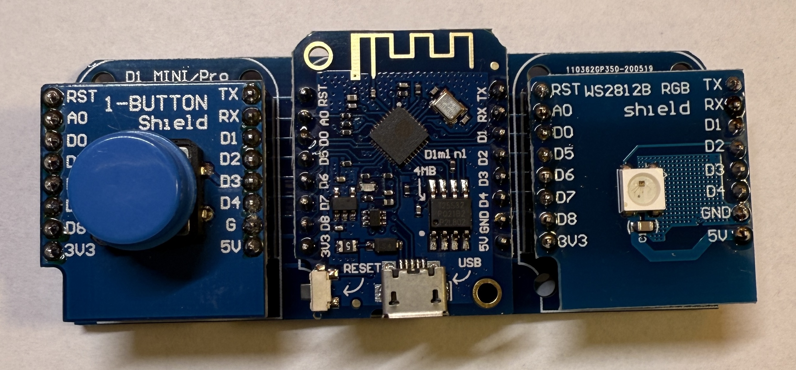

[<< Zurück](../README.md)

# Licht Schalter

## Bilder



## Blockschaltbild


## Beschreibung

Für dieses Projekt verwenden wir ein Tasten Modul und ein RGB LED Modul.

## Anwendung

Das Tasten Modul und das RGB LED Modul stecken wir auf die freien Steckplätze des Basisboards neben dem Micronctonroller Board. Achte auf die richtige Orientierung der Pins, RST auf RST und Tx auf Tx.

## Bibliothek

Folgende Bliothek wird benötiogt. Installiere diese über den Bibliotheks Verwalter:

- Adafruit Neo Pixelvon Adafruit (Getestet Version 1.12.4)

## Beispielprogramm 1: Ein- und Ausschalten der LED mit der Taste

In dem ersten Programm wollen wir die RGB LED in grün ein- und ausschalten wenn wir die Taste drücken.

```
// Verwendete Bibliotheken
#include <Adafruit_NeoPixel.h>

const int tasten_pin = D3;
const int led_pin = D2;

int tasten_zustand = 0;
int letzter_tasten_zustand = 0;
int LED_zustand = 0;

#define ANZAHL_PIXEL  1

Adafruit_NeoPixel pixels(ANZAHL_PIXEL, led_pin, NEO_GRB + NEO_KHZ800);

// Diese Funktion initialisert den Mikrocontroller und das Programm
void setup()
{

  pixels.begin();  // Intialisierung der NeoPixel Bibliothek

  pinMode(tasten_pin,INPUT);

}

// Die folgende Funktion wird immer und immer wieder aufgerufen
void loop()
{

  tasten_zustand = digitalRead(tasten_pin);
  
  if((letzter_tasten_zustand == LOW) && (tasten_zustand == HIGH))
  {
     if(LED_zustand == LOW)
       LED_zustand = HIGH;
     else if(LED_zustand == HIGH)
       LED_zustand = LOW;
  }

  letzter_tasten_zustand = tasten_zustand;

  if(LED_zustand == HIGH)
  {
    pixels.clear();   // Alle Pixel zurücksetzen
    pixels.setPixelColor(0, pixels.Color(0, 255, 0));   // Setze die drei Farben Rot, Grün, Blau
    pixels.show();    // Sende die neue Farbe an die LED
  }
  else
  {
    pixels.clear();   // Alle Pixel zurücksetzen
    pixels.setPixelColor(0, pixels.Color(0, 0, 0));   // Setze die drei Farben Rot, Grün, Blau
    pixels.show();    // Sende die neue Farbe an die LED
  }
  
}
```

## Beispielprogramm 2: Ein- und Ausschalten der LED und ändern der Farbe mit der Taste

In zweiten Programm wollen wir die RGB LED durch Langdruck ein- und ausschalten und wenn wir kurz drücken die Farbe ändern.

```
// Verwendete Bibliotheken
#include <Adafruit_NeoPixel.h>

const int tasten_pin = D3;
const int led_pin = D2;
const int lang_druck_dauer = 3000;

int tasten_zustand = 0;
int tasten_druck_dauer = 0;
int letzter_tasten_zustand = 0;
int LED_zustand = HIGH;
int LED_rot = 0;
int LED_gruen = 255;
int LED_blau = 0;

#define ANZAHL_PIXEL  1

Adafruit_NeoPixel pixels(ANZAHL_PIXEL, led_pin, NEO_GRB + NEO_KHZ800);

// Diese Funktion initialisert den Mikrocontroller und das Programm
void setup()
{

  pixels.begin();  // Intialisierung der NeoPixel Bibliothek

  pinMode(tasten_pin,INPUT);

}

// Die folgende Funktion wird immer und immer wieder aufgerufen
void loop()
{

  tasten_zustand = digitalRead(tasten_pin);

  if(tasten_zustand == LOW && tasten_druck_dauer == lang_druck_dauer)
  {
    if(LED_zustand == LOW)
      LED_zustand = HIGH;
    else if(LED_zustand == HIGH)
      LED_zustand = LOW;
  }

  if((letzter_tasten_zustand == LOW) && (tasten_zustand == HIGH))
  {
    if(tasten_druck_dauer<lang_druck_dauer)
    {
        if(LED_rot == 255)
        {
          LED_rot = 0;
          LED_gruen = 255;
        }
        else if(LED_gruen == 255)
        {
          LED_gruen = 0;
          LED_blau = 255;
        }
        else if(LED_blau == 255)
        {
          LED_blau = 0;
          LED_rot = 255;
        }
    }
  }

  if(tasten_zustand == HIGH)
    tasten_druck_dauer = 0;
  if(tasten_zustand == LOW)
    tasten_druck_dauer = tasten_druck_dauer + 1;

  letzter_tasten_zustand = tasten_zustand;

  if(LED_zustand == HIGH)
  {
    pixels.clear();   // Alle Pixel zurücksetzen
    pixels.setPixelColor(0, pixels.Color(LED_rot, LED_gruen, LED_blau));   // Setze die drei Farben Rot, Grün, Blau
    pixels.show();    // Sende die neue Farbe an die LED
  }
  else
  {
    pixels.clear();   // Alle Pixel zurücksetzen
    pixels.setPixelColor(0, pixels.Color(0, 0, 0));   // Setze die drei Farben Rot, Grün, Blau
    pixels.show();    // Sende die neue Farbe an die LED
  }
  
}
```


[<< Zurück](../README.md)
