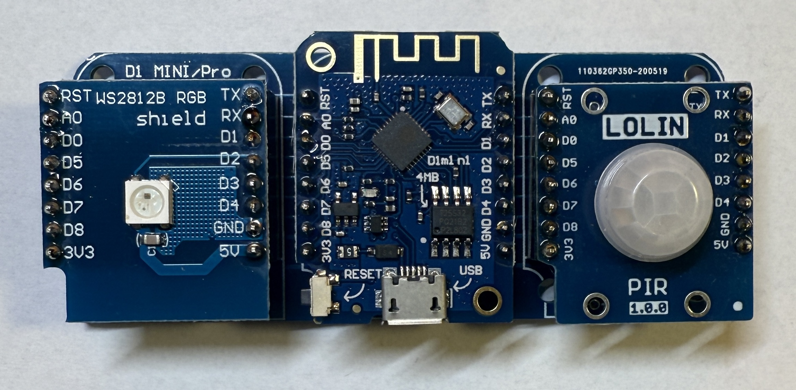
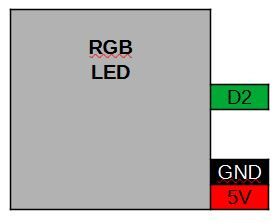
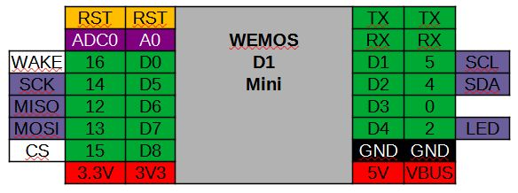
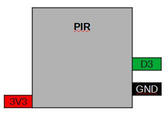

[<< Zurück](../README.md)

# PIR Licht

## Bilder



## Blockschaltbild



## Beschreibung

Für dieses Projekt verwenden wir ein RGB LED Modul und ein PIR Modul.

## Anwendung

Das RGB LED Modul und das PIR Modul stecken wir auf die freien Steckplätze des Basisboards neben dem Micronctonroller Board. Achte auf die richtige Orientierung der Pins, RST auf RST und Tx auf Tx.

## Bibliothek

Folgende Bliothek wird benötiogt. Installiere diese über den Bibliotheks Verwalter:

- Adafruit Neo Pixelvon Adafruit (Getestet Version 1.12.4)

## Beispielprogramm 1: Ein- und Ausschalten der LED durch Bewegung

In dem ersten Programm wollen wir die RGB LED in grün ein- und ausschalten wenn wir uns bewegen.

```
const int pin = D3;
int PIR_zustand = 0;

// Diese Funktion initialisert den Mikrocontroller und das Programm
void setup()
{

  pinMode(pin, INPUT);
  pinMode(BUILTIN_LED, OUTPUT);

  digitalWrite(BUILTIN_LED, HIGH); // Schalte LED aus

}

// Die folgende Funktion wird immer und immer wieder aufgerufen
void loop()
{

  PIR_zustand = digitalRead(pin);   // Lese des Status des PIR

  if (PIR_zustand == HIGH)
    digitalWrite(BUILTIN_LED, LOW);  // Schalte LED ein
  else
    digitalWrite(BUILTIN_LED, HIGH); // Schalte LED aus
  
}
```

[<< Zurück](../README.md)
