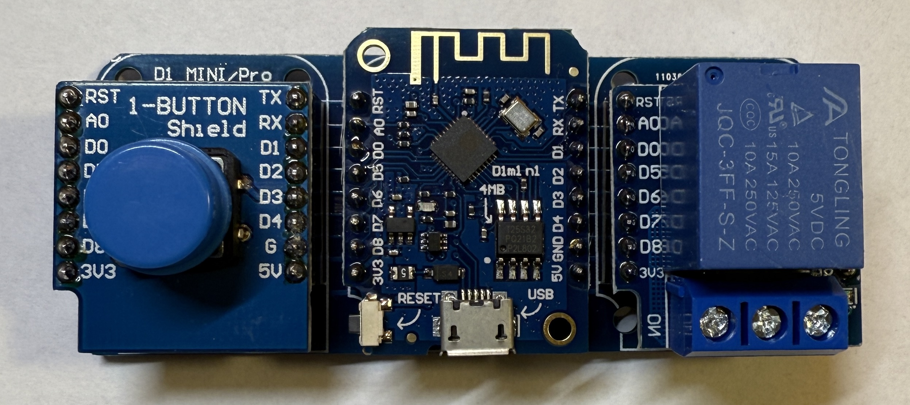

[<< Zurück](../README.md)

# Licht Schalter

## Bilder



## Blockschaltbild


## Beschreibung

Für dieses Projekt verwenden wir ein Tasten Modul und ein Relais Modul.

## Anwendung

Das Tasten Modul und das Relais stecken wir auf die freien Steckplätze des Basisboards neben dem Microcontroller Board. Achte auf die richtige Orientierung der Pins, RST auf RST und Tx auf Tx.

## Bibliothek

- keine

## Beispielprogramm 1: Ein- und Ausschalten des Relais mit der Taste

In dem ersten Programm wollen wir das Relais mit der Taste ein- und ausschalten

```
```

[<< Zurück](../README.md)
