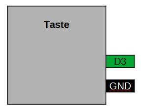
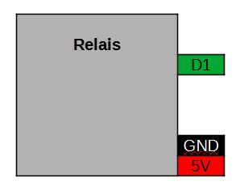

[<< Zurück](../README.md)

# Licht Schalter

## Bilder


## Blockschaltbild



## Beschreibung

Für dieses Projekt verwenden wir ein Tasten Modul und ein Relais Modul.

## Anwendung

Das Tasten Modul und das Relais stecken wir auf die freien Steckplätze des Basisboards neben dem Microcontroller Board. Achte auf die richtige Orientierung der Pins, RST auf RST und Tx auf Tx.

## Bibliothek

- keine

## Beispielprogramm 1: Einschalten des Relais solange die Taste gedrückt ist

In dem ersten Programm wollen wir das Relais mit der Taste einschalten solange wir die Taste drücken.

```
const int tasten_pin = D3;
const int led_pin = BUILTIN_LED;
const int relais_pin = D1;  // Initialisiere den Pin für das Relais

int tasten_zustand = 0;

// Diese Funktion initialisert den Mikrocontroller und das Programm
void setup() {

  pinMode(led_pin,OUTPUT);
  pinMode(tasten_pin,INPUT);

  digitalWrite(led_pin, tasten_zustand);

  pinMode(relais_pin, OUTPUT);

}

// Die folgende Funktion wird immer und immer wieder aufgerufen
void loop() {

  tasten_zustand = digitalRead(tasten_pin);
  
  if(tasten_zustand == HIGH)
  {
    digitalWrite(relais_pin, LOW); // Relais ausschalten
  }
  else
  {
    digitalWrite(relais_pin, HIGH);  // Relais einschalten
  }
  
}
```

### Aufgabe 1: Relais ein- und ausschalten jeweils mit einem Tastdendruck

Schalte das Relais ein wenn du die Taste drückst und wieder aus wenn du noch einmal drückst.

Unter folgendem Link findest du die Lösung der ersten Aufgabe.

[Lösung Aufgabe 1](loesung_1.md)

[<< Zurück](../README.md)
